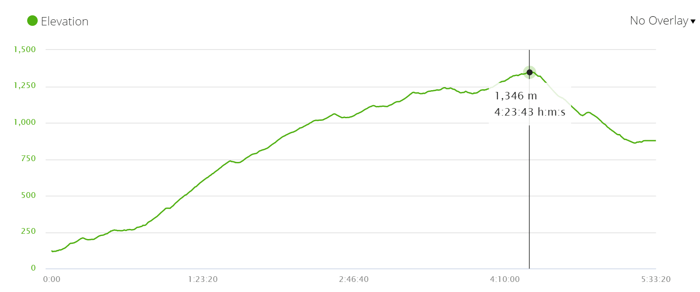

* Distance – 25 km/15,5 mi
* Time – 5h30min.*
* Walking on asphalt – 14 km/8,6 mi
* Walking on the road – 3 km/1,8 mi over the pass, a very quiet road, there were one or two cars
* Ascent – 1400 m
* Descent – 650 m
* Difficulty level – 5 out of 5

## Highlights

* Stunning scenery; mountains, green hills, lookouts, patches of the forest if it wasn’t for the steep climb it would be a very pleasant walking day.
* Albergue Colegiata in Roncesvalles is a big and impressive old building.
* Beautiful service at the church of the Colegiata at 6pm.
