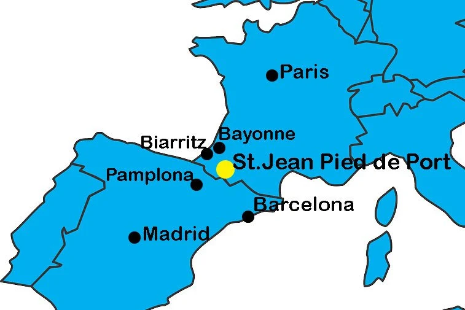
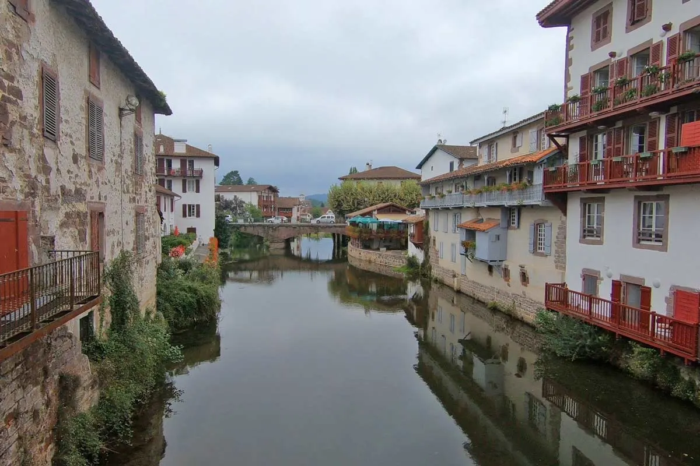

ref: [How to get to St.Jean Pied de Port](https://stingynomads.com/st-jean-pied-de-port-how-go-get/)

## How to get to SJPDP

### From Spanish Direction

* Madrid - Pamplona
  * Flight - Iberia Airlines and Vueling. **1 hour, &euro;23**
  * [Bus/ALSA](https://www.alsa.com/en/web/bus/home) - leave from the Avenida America Bus Station and Barajas Airport Terminal 4 (T4). **5~6hours, &euro;22~30.**
    * one ticket, transfer in Zaragoza or Soria.
  * [Train/RENFE](https://www.renfe.com/es/en) - 10+ daily trains leave from the Atocha Train Station. **3~4 hours, &euro; 20~30.**
    * get to the bus station first in Pamplona to catch a bus to SJPDP.
* Barcelona - Pamplona
  * [Train/RENFE](https://www.renfe.com/es/en) - 3-4 daily direct trains from Barcelona Sants Train Station. **4 hours. &euro;40~50.**
  * Buses/MonBus/FlixBus - Nord and Barcelona Sants bus stations. There are two buses to Pamplona (one day and one night). **6 hours &euro 30**.
* Pamplona - SJPDP
  * **Only one** direct [bus/ALSA](https://www.alsa.com/en/web/bus/home) at **noon**, **1:45**, **&euro; 22**.

### From French Direction

* Paris - Bayonne
  * Direct trains leave from Montparnasse Station (Gare Montparnasse). **4 hours, &euro; 60+**.
  * Bus leave from Bercy Seine Bus Station. **10-12 hours, &euro; 40+**.
* Bayonne - St.Jean Pied de Port
  * there are **six** direct daily trains. The departure times are 6.29, 8.42, 12.25, 14.12, 17.03, and 18.27
  * The journey: **1h:15**, **&euro; 11**.

## Where To Stay

* Budget
  * Gîte BIDEAN
  * Gite Compostella
  * Gîte Le Chemin vers l’Etoile
* Middle price
  * Gîte Zuharpeta Randonneur Pelerin
  * La Coquille Napoléon
* Luxury
  * Gite Makila
  * Maison Simonenia

## Things To Do

See the Gate of St. James (Porte St Jacques) at the top of the hilltop village that welcomes pilgrims who started their pilgrimage before SJPDP

Don’t miss the views of the old houses with balconies overlooking the Nive from rue de la Citadelle crosses the river over a bridge.

Go to pilgrim mass at the beautiful Notre Dame Gothic Church.

Visit the 17th-century citadel overlooking the town.

Visit the the Saint Jean Pied de Port Pilgrim Office. They can answer any questions you have on the Camino, register here, and pick up an updated Albergue list for the complete route.