今天重点讲一讲西餐中常见的6种香草，以及它们常用的搭配。每种香草都有自己独特的风味，也有一定的搭配套路，就像我们中餐用的葱姜蒜八角花椒。只要掌握了它们的味道和用法，下次再见到，你就不会头大啦。

|香草|常见套路|其他|
|:---|:---|:---|
|[甜罗勒 Basil](#basil)|青酱，番茄|闻起来有淡淡的薄荷味，尝起来甜中略微带点茴香的味道|
|[百里香 Thyme](#thyme)|炖煮肉类|气味浓郁却温和不刺激，不会盖住其他香草的味道|
|[迷迭香 Rosemary](#rosemary)|烤牛羊肉|似于松针的木香，新鲜的甚至还有点淡淡的柑橘或柠檬的香味|
|[薄荷 Mint](#mint)|羊肉，饮品|闻起来味道清清凉凉，清新又提神|
|[欧芹 Parsley](#parsley)|牛羊肉、海鲜|去腥的同时，还能给食物带来清新的香气|
|[莳萝 Dill](#dill)|三文鱼等海鲜，腌黄瓜|气味香甜，闻起来不刺激，有点类似奶油的味道|

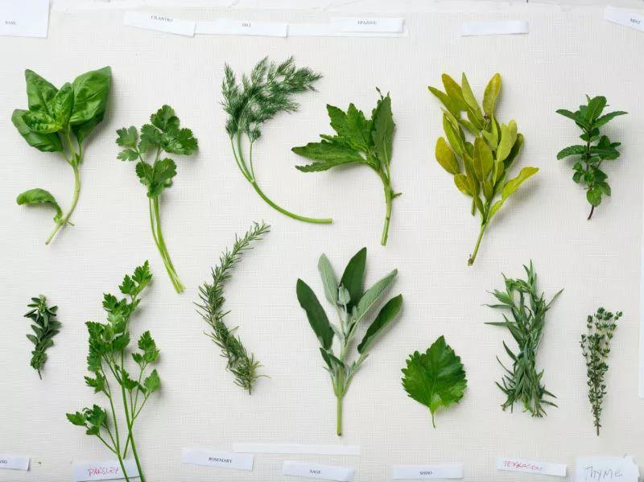

## 甜罗勒 | Sweet Basil {#basil}

常见套路：青酱，番茄

罗勒的品种很多，常见的有甜罗勒（Sweet Basil），泰式罗勒（Thai Basil），柠檬罗勒（Lemon Basil）。不同品种的罗勒味道不大一样，叶片长得也不尽相同

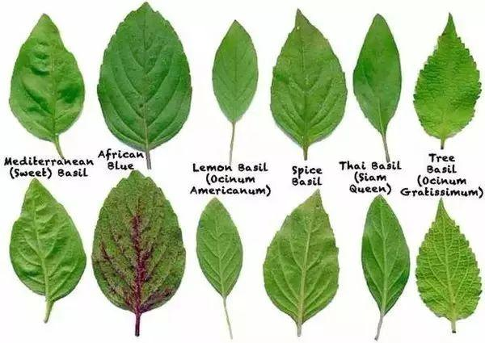

西餐中最常用的是甜罗勒（Sweet Basil），它的形状有点像菠菜叶，表面光滑有光泽。因为叶片较大，也有人称为“大叶罗勒”。闻起来有淡淡的薄荷味，尝起来甜中略微带点茴香的味道。

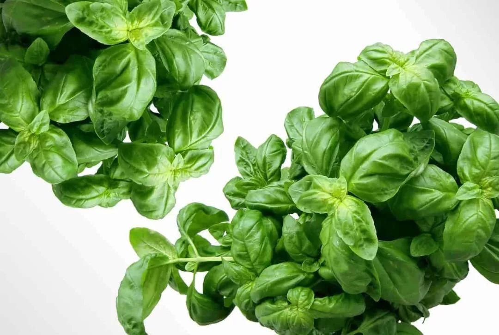

新鲜的罗勒很容易氧化变黑，从冰箱拿出来后最好用水泡着，避免直接暴露在空气中。如果一次买太多，做成青酱是个不错的选择。

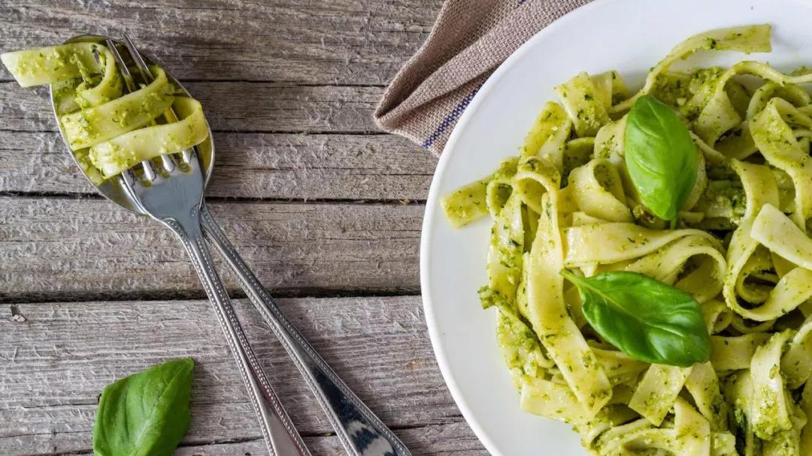

青酱是意面的经典搭配，做法也简单，罗勒、大蒜、松子、帕玛森干酪、橄榄油一起打成泥就好了。冷吃或热吃，用来涂抹面包或者拌面都很美味~

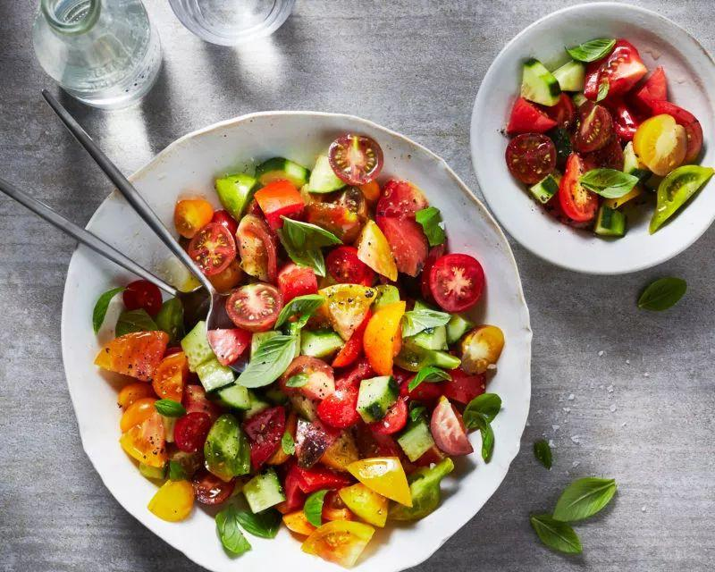

除了青酱，罗勒还有一个官配cp——番茄，做番茄罗勒红酱意面或者沙拉、披萨都少不了它们。罗勒的甜和番茄的酸结合在一起可以说是非常刺激食欲了，而且卖相也好看。

## 百里香 | Thyme {#thyme}

常见套路：炖煮肉类

百里香是一种短而结实的半灌木，枝条细长，叶片虽小香味却很浓郁，因此也有“麝香草”之称。是许多地中海菜肴和欧式菜肴中都会使用的一款香草。

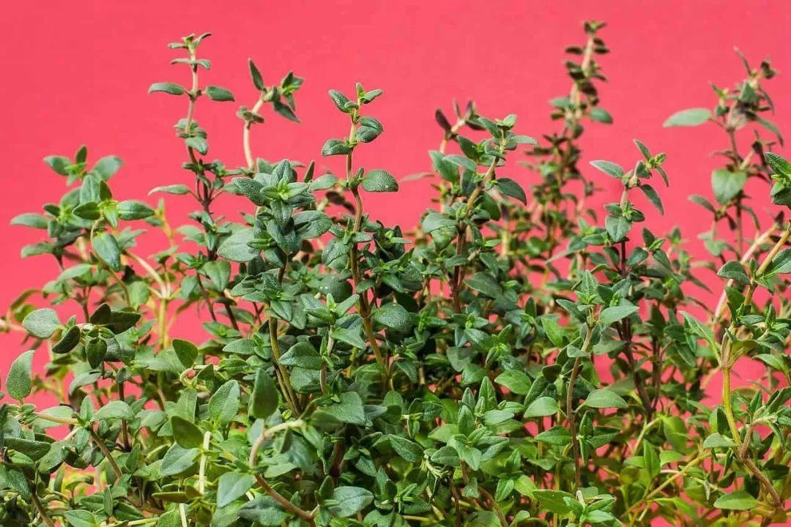

因为气味浓郁却温和不刺激，不会盖住其他香草的味道，所以百里香经常会用来与其他香草进行调和。最常见的例子，就是法式炖菜中的香草束。

百里香、欧芹的茎和月桂叶的经典组合在法文里叫“Bouquet Garni”，意思是香草束，几乎所有炖菜都会用到。如果是用新鲜的香草，就把3种香草用棉绳绑在一起，整束放入锅中增香，炖好了再一次取出。如果买不到新鲜香草，则用瓶装干香草料替代。

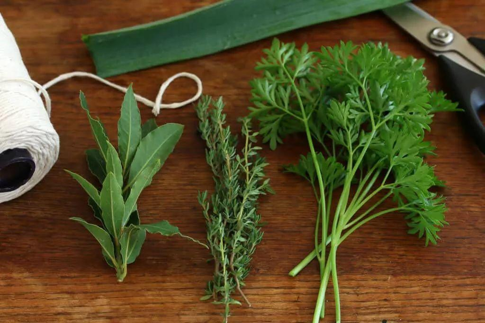

除了法式炖菜，在炖煮其他肉类，例如猪牛羊鸡鸭海鲜时，也可以加上一两枝百里香去腥。

不过呢，百里香需要慢慢加热才能让味道彻底散发出来，所以最好一开始就放它，让香气慢慢浸透到食物中。

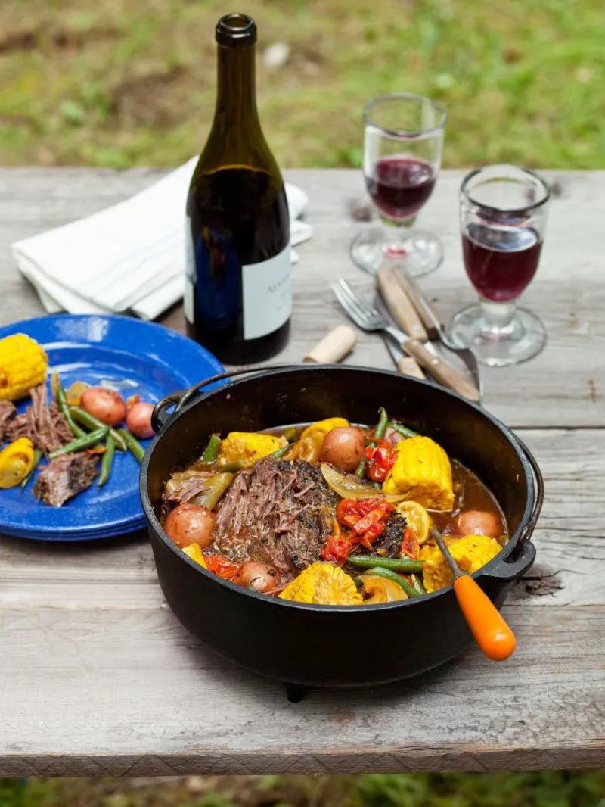

如果新鲜的百里香不好买到，用干的百里香草碎替代也是完全没问题的。

## 迷迭香 | Rosemary {#rosemary}

常见套路：牛羊肉

迷迭香在拉丁语中，意指“海之露”，因为它是地中海地区本土的产物。迷迭香是所有香草中最香、最辛辣的一种。

它有类似于松针的木香，新鲜的甚至还有点淡淡的柑橘或柠檬的香味。事实上，迷迭香的枝叶看起来也确实很像松针，细细长长。

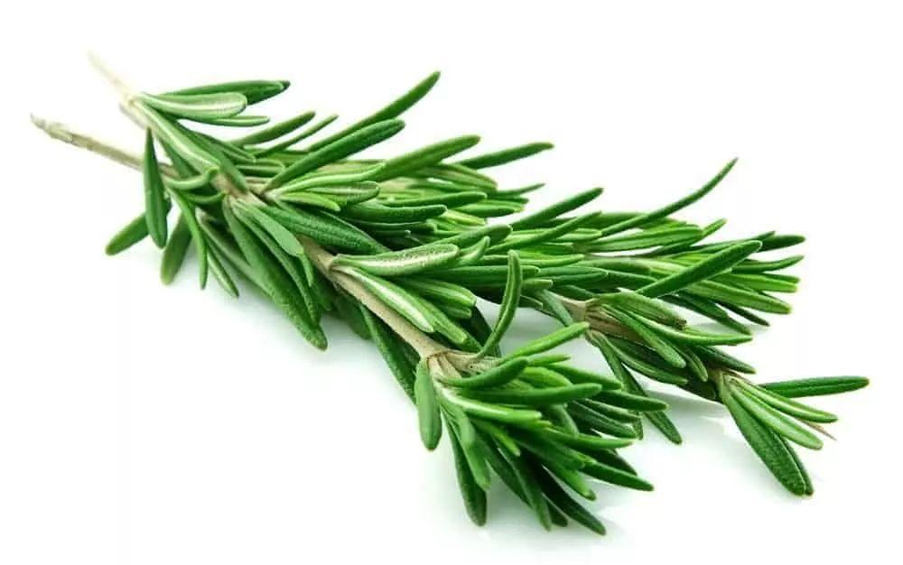

迷迭香常与烤肉、烤土豆一起食用，也适合用在汤和炖肉中添加香味。因为用法与百里香有相似之处，有时候会被弄混。

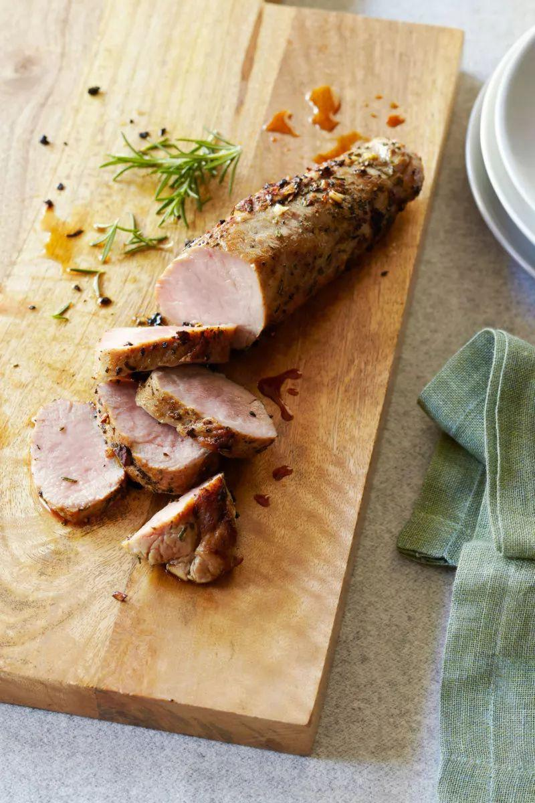

不过迷迭香的气味比百里香浓郁很多，还掺有一丝苦味，所以用的时候千万不要多放。不过，也正因为迷迭香的香气浓郁，更适合与味道重的食材搭配，例如羊肉、牛肉，既能去腥，又能压住它们的味道。

## 薄荷 | Mint {#mint}

常见套路：羊肉，饮品

薄荷应该是大家最熟悉也是最容易买到的一款香草了，一般我们常用的的品种是留兰香薄荷（Spearmint），叶子上有条理清晰的纹路，闻起来味道清清凉凉，清新又提神。

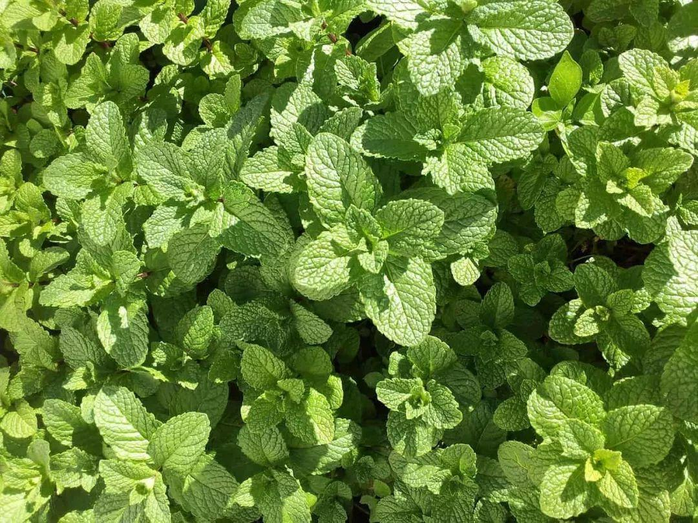

在西餐中，薄荷和羊肉是比较经典的搭配，但在国内这样的搭配并不算普及，倒是云南等地区会有薄荷牛肉，炸薄荷等吃法，有的地方还会在烤鱼时放入薄荷，去腥提香。

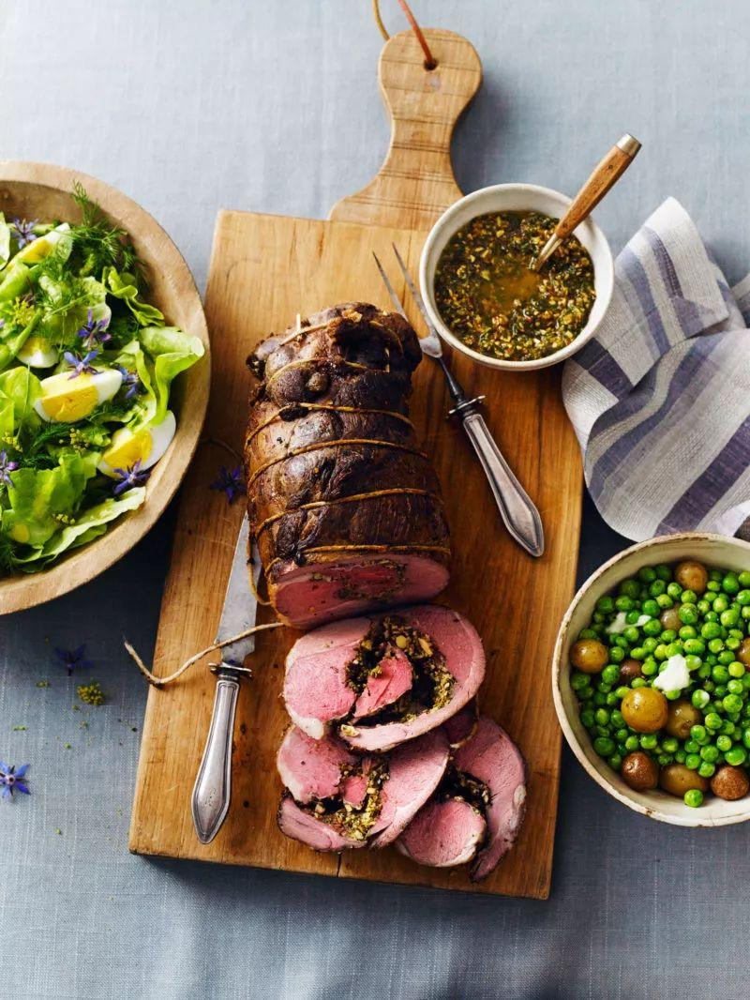

除了入菜，薄荷与各种气泡饮料、酒也很搭，例如常见的Mojito，柠檬薄荷汽水等等，清爽的口感最适合夏日了。

因为颜色清新，薄荷也常常被用来摆盘装饰，哪怕是再平常不过的一道菜，装点上一小撮薄荷叶，颜值瞬间就不一样了。

## 欧芹 | Parsley {#parsley}

常见套路：牛羊肉，海鲜，装饰

欧芹也叫洋香菜、西洋芹、洋芫荽，不仅长相上与香菜和芹菜相似，闻起来也和芹菜有些像。但其实三者所属的科目是不一样的，欧芹是欧芹属，芹菜是芹属，香菜是芫荽属。

市面上常见的欧芹有两种，一种是叶子扁平的平叶欧芹（flat-leaf parsley），外形上和香菜很像，但平叶欧芹末端叶子是尖尖的，香菜的则是圆圆的。

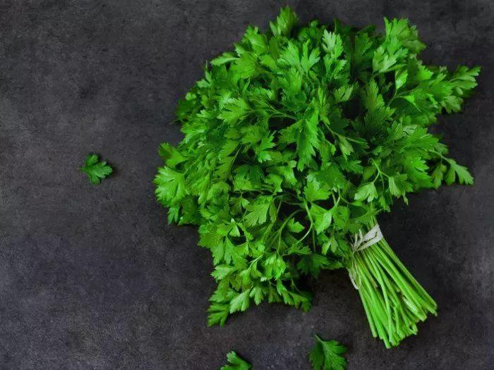

另一种是叶子蜷曲的卷叶欧芹（curly-leaf parsley），除了入菜外，更常见到的是折一小撮用来摆盘。又因为外形好看，卷叶欧芹更适合切碎，撒在各种汤、菜、面、沙拉上等来装饰。

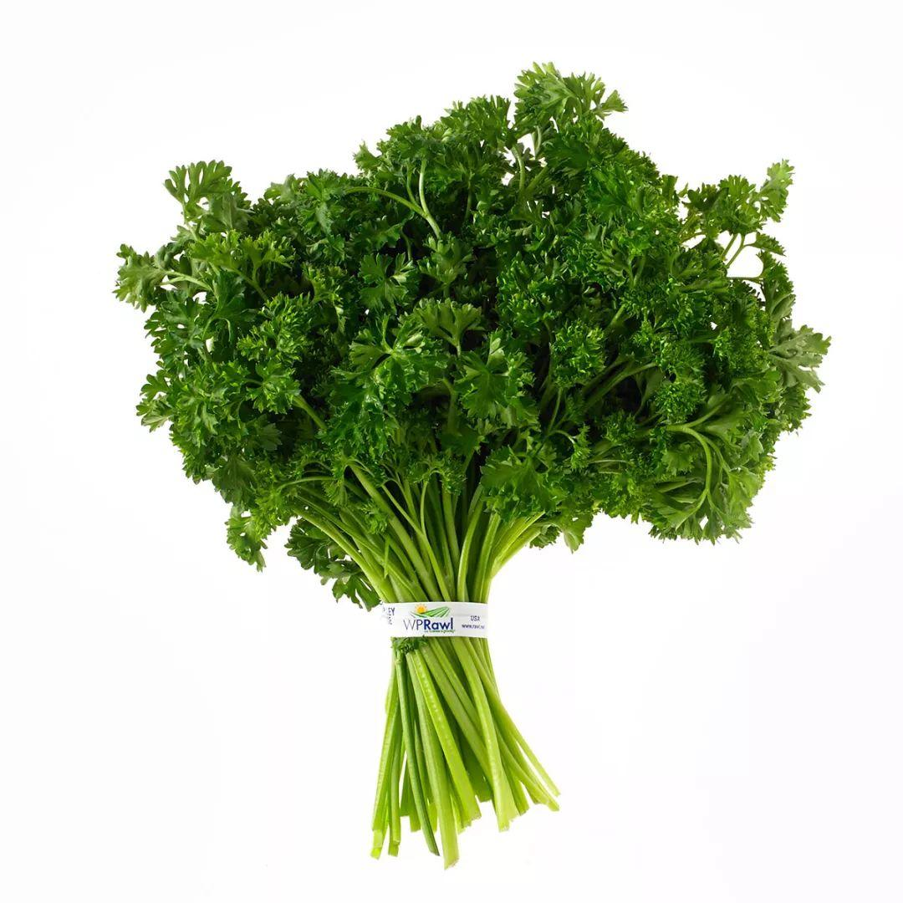

欧芹的香气和牛羊肉、海鲜都很搭，去腥的同时，还能给食物带来清新的香气。一般市面上更容易买到的是平叶欧芹，不过两款欧芹的味道相差不大，完全可以互相替代来使用。

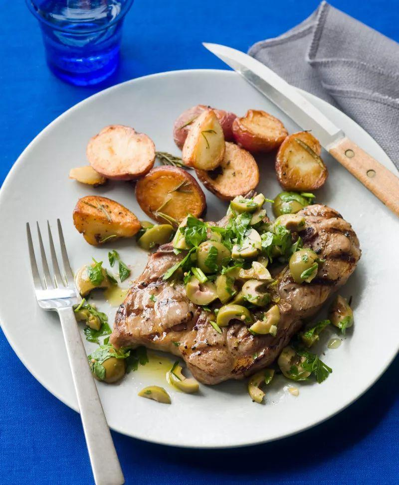

不过固执的意大利人做菜时通常只选择平叶欧芹，在意大利人写的菜谱里，你很难看到用卷叶欧芹的。这也是为什么平叶欧芹还有个名称叫“意大利香芹”。

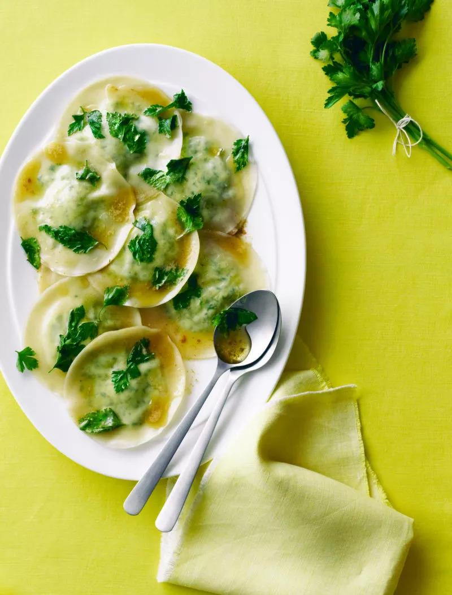

## 莳萝 | Dill {#dill}

常见套路：三文鱼等海鲜，腌黄瓜

莳萝（Dill，广东地区也叫刁草）。叶子一丝一丝的，有点像羽毛，看起来很轻盈。气味香甜，闻起来不刺激，有点类似奶油的味道。

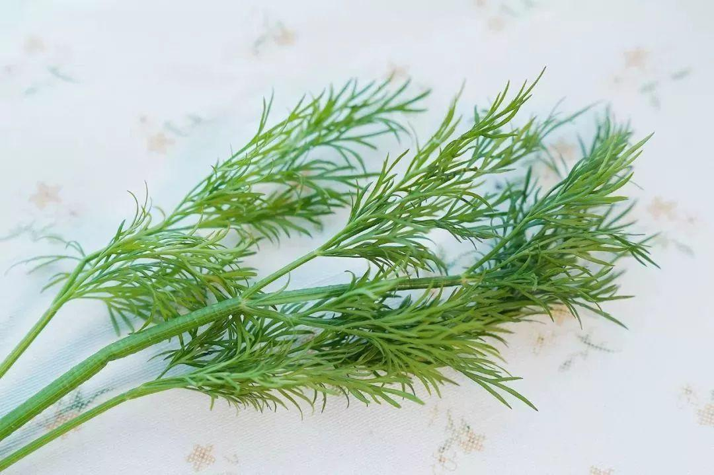

因为长相近似，很多人会把莳萝和茴香弄混，其实它们不是同一种东西，不过从叶子到花都无法用肉眼区分，只能等种子完全成熟干燥后才能看出。所以购买的时候要注意看标签哟~

莳萝（左）和茴香（右）的科学绘图

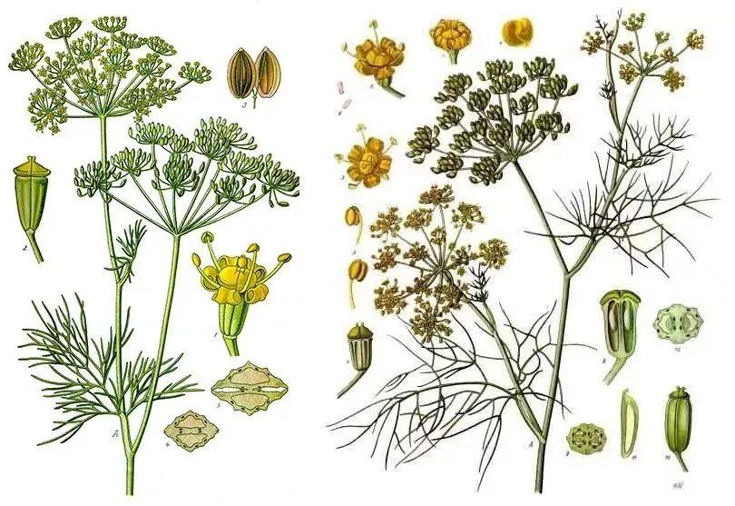

莳萝最常见的用法之一是制作西式泡菜，例如腌黄瓜。黄瓜用莳萝、盐和蒜盐渍后，吃起来特别爽脆开胃，可以直接当小菜吃，也可以在做沙拉时丢一些进去，味道更丰富。

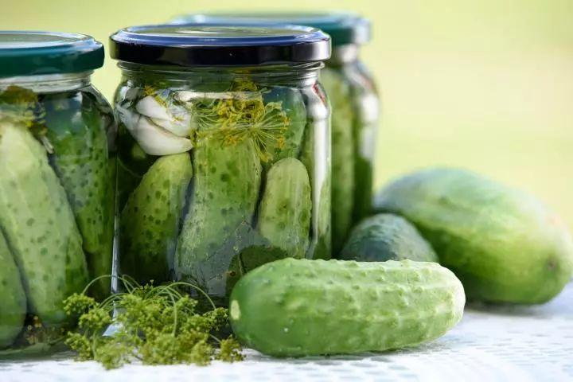

其次就是海鲜搭配，不仅能去腥，还能增添香气。三文鱼和莳萝可以说是非常经典的一对cp了。东欧和中欧地区的料理中，通常会直接抓一把莳萝或者切碎撒在鱼身上一起煎。

除此之外，煎炒蛋，做沙拉，或者煮土豆时加入莳萝，也是也常见的用法，例如之前做西班牙煎厚蛋时，就少不了它。

篇幅缘故，今天的西餐常用香草干货就到这里啦，感兴趣的小伙伴可以留言补充哟，或者把你想知道的选题告诉菜菜，说不定下一期的干货日记就是它了呢。
