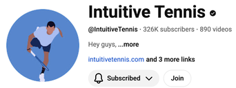

By 



- title: 1. Forehand, Backhand & Serve
  yt: YqgcykDGB2A
  text: Learn the forehand, backhand, and serve in this beginner tennis lesson. The instructor demonstrates proper grip and swing techniques, breaking down each stroke step-by-step. Perfect for those new to the sport!

- title: 2. Forehand Volley, Backhand Volley & Overhead
  yt: _5ZRb-DyTzI
  text: Learn the forehand, backhand, and overhead volleys in this beginner tennis lesson. A coach demonstrates proper technique and grip, progressing from stationary to moving volleys. The lesson concludes with practicing more challenging shots.
  
- title: 3. How to Keep The Ball in Play
  yt: mdfFGXCsHYI
  text: If you are a beginner and want to improve your tennis game it is crucial that you learn how to keep the ball in play. Once you learn the fundamentals of each stroke I recommend that you transition into rallying rather quickly which will develop additional skill sets in your game and most importantly allow you to play tennis with others.
  
- title: 4. Forehand, Backhand & Volleys
  yt: 2wK5ULLmcgc
  text: >
    In this beginner tennis lesson, I teach my student Anna how to play against the tennis wall. We worked on forehands, backhands, and volleys. It turns out that the wall is a suitable partner even at the beginner level. (0:00 Forehand, 3:09 Backhand, 6:10 Volleys)

- title: 5. How to Hit Overheads on The Tennis Wall
  yt: vF39744ENZU
  text: The tennis wall is a great way to practice all tennis strokes. One of the more difficult ones to master is the overhead. In today's lesson, I teach my student Anna how to hit overheads on the tennis wall.
  
- title: 6. Modern Forehand
  yt: W1Ef8HFZAuU
  text: Anna is progressing nicely with her tennis game. Now that the basic fundamental forehand elements are set in place it's time to further improve her forehand. Watch my student Anna learn the modern forehand tennis technique.
  
- title: 7. Tennis Serve
  yt: 2LQvpHO59nE
  text: In today’s tennis lesson, I teach Anna the serve. She learned how to properly sync the toss arm with the racquet arm and other technical elements of the serve.
  
- title: 8. Serve Power
  yt: XWZ4qCRP_BE
  text: In today’s tennis lesson I teach Anna how to develop more power on the serve by using her body in the most efficient way. This tennis lesson focuses on generating serve power through efficient body mechanics. The instructor demonstrates how to use torso rotation and "passive leg drive" for more effortless power. Learn how small adjustments to technique can significantly impact serve strength.
  
- title: 9. Two-Handed Backhand
  yt: Wnjl2VxV1wc
  text: In today's tennis lesson, I teach Anna two-handed backhand fundamentals. This tennis lesson focuses on improving a two-handed backhand. The instructor demonstrates proper elbow and wrist positioning, emphasizing a full rotation for effortless power. Drills incorporate on-the-run shots and controlled acceleration.
  
- title: 10. How to Play With Feel
  yt: dlb-k-_00zQ
  text: In today’s tennis lesson, I teach Anna how to play with more feel. Learning how to hit the ball gently is crucial in developing control. The exercises performed in this video are great for that.
  
- title: 11. Tennis Technique and Drills
  yt: 13sOE8sFqUw
  text: Today's video features a practice session with Anna. I usually start my lessons with live ball and then progress to drills to work on different aspects of my student's game. In this particular training session, we focused on Anna's tennis technique and performed various drills. 
  
- title: 12. Volley, Swing Volley, & Bouncing Overhead
  yt: xgW8Fzif7ok
  text: In today’s video with Anna, we worked on her volley, swing volley, and the bouncing overhead.
  
- title: 13. Ball Recognition & Movement 
  yt: TBlybgcwSXg
  text: In today's tennis lesson with Anna, we work on ball recognition and movement.
  
- title: 14. Reading Comments From Anna’s Viral Beginner Tennis Lesson Video
  yt: _Tv52oWHYH4
  
- title: 15. How to Aim in Tennis
  yt: Pnpr0Uz9QHI
  text: In today’s video, I teach my student Anna how to aim in tennis.
  
- title: 16. Preparing Anna For Her First Tennis Match (EVER)
  yt: QSyvY05wMlE
  text: >
    In today’s video, I prepare my student Anna for her first tennis match.
    Anna’s Instagram: annarogers7
    A tennis coach prepares a student for their first-ever match. The lesson covers scoring, rules, and basic tactics, including serve techniques and return positioning. Watch as they practice gameplay and strategies for a successful debut.
  
- title: 17. How to Practice With a Tennis Ball Machine
  yt: opKYyVLo9K0
  text: A tennis coach instructs a student on using a ball machine. The lesson focuses on forehand and backhand techniques, emphasizing proper footwork and racket positioning. Close-up views allow for detailed analysis of the student's form.
  
- title: 18. Anna’s First Tennis Match
  yt: S-vtW3_IwSc
  text: Witness Anna's debut tennis match! The video follows their preparation and gameplay, offering insights into basic tennis etiquette and strategy. A coach provides real-time feedback and guidance on technique and court positioning.
  
- title: 19. How to Get More Topspin on the Forehand
  yt: HvsejNwj6HI
  text: I teach my student Anna how to get more topspin on her forehand and increase consistency.
  
- title: 20. How to Hit the One-Handed Slice Backhand
  yt: FBGbizALTq0
  text: This Intuitive Tennis lesson focuses on the one-handed slice backhand. The instructor breaks down the technique, emphasizing proper contact and elbow movement. Starting with short swings, they progressively increase distance for a complete learning progression.
  
- title: 21. How to Play Low Balls in Tennis (Slice & Sidespin)
  yt: _49U3I_SRWQ
  text: >
    I teach my student Anna how to play low balls including defending against slice and sidespin shots.
    0:00 Anna’s Low Ball Problem
    1:21 Why Rec Players Struggle with Low Balls
    2:34 Low Ball Solution
    7:48 Keep Moving & Watching the ball
    This tennis lesson focuses on defensive strategies against low slice and sidespin shots. The instructor demonstrates techniques to counter unpredictable shots, emphasizing real-time ball tracking and maintaining movement. Proper shot selection and low stances are also key components of the lesson.
  
- title: 22. Fixing Anna’s Toss & Forehand Grip
  yt: K_iz3u-Ye48
  
- title: 23. How to Play the Short Forehand | 3.0 NTRP Tennis Lesson
  yt: rEt6XYyltCQ
  text:  I teach Anna (3.0 NTRP) how to play the short forehand, including working on ball recognition, timing, positioning, and footwork.
  
- title: 24. Fixing Anna’s Two Handed Backhand
  yt: 9uvzWGFx_WU
  text: This tennis lesson focuses on improving a two-handed backhand technique. The coach addresses stance and footwork, emphasizing proper spacing and rotation. Drills and adjustments are demonstrated to refine the stroke and build confidence.
  
- title: 25. Anna Has Tennis Elbow 😭 (or maybe not 🙏)
  yt: 8TyXPxT3_i4
  text: In today’s tennis lesson with Anna (3.0 NTRP Player) she experienced some elbow pain. I hope it’s not tennis elbow 🙏.
  
- title: 26. The Best Tennis Elbow Stretches & Exercises
  yt: DBgm5o0-C44
  text: I help Anna get rid of her tennis elbow by changing her racquet, string tension, and grip size. Also, I show her the best exercises and stretches to help alleviate the pain in her arm.
  
- title: 27. Switching Anna’s Forehand Grip to Semi-Western
  yt: QVIY_6OdHQ
  
- title: 28. Fixing Anna’s Forehand Takeback
  yt: _WDvnc0lNpE
  text: I fix Anna’s forehand takeback by allowing the wrist to be in a more neutral position.
  
- title: 29. Forehand & Backhand Volley Transformation (Srdan Aracic Method)
  yt: nsyQqSxJYcY
  text: I transformed my student Anna’s forehand and backhand volley in just 30 minutes, including Intuitive drills from my dad, Srdan Aracic.
  
- title: 30. The Objective is Consistency
  yt: 6ZUp6rFkS7U
  text: I explain to my advanced beginner student Anna why consistency is the number 1 objective in tennis. This Intuitive Tennis lesson focuses on achieving consistency in tennis shots. The coach works with a student on forehand technique, addressing issues with shot placement and wrist movement. The goal is to develop the ability to maintain extended rallies.
  
- title: 31. Tennis Footwork Fundamentals 💃
  yt: N-GsLBRKTkc
  
- title: 32. Two-Handed Backhand 3-Step Timing Progression
  yt: egMhSF7BhjU
  text: We work on recalibrating the two-handed backhand after her long absence from the game.
  
- title: 33. How to Improve Forehand Timing
  yt: 1ZzT-1Evv5g
  
- title: 34. How to Beat a Moonballer as a Lower Level Rec Player
  yt: TLwrXZCGOR4
  
- title: 35. Tennis Serve Fundamentals Reintroduction 
  yt: OJxe1_GvT-E
  text: A tennis coach helps a student relearn their serve after a three-year break due to foot surgery. The instructor focuses on rhythm and toss technique, addressing common serving issues. This lesson revisits fundamental elements to rebuild a strong serve.


