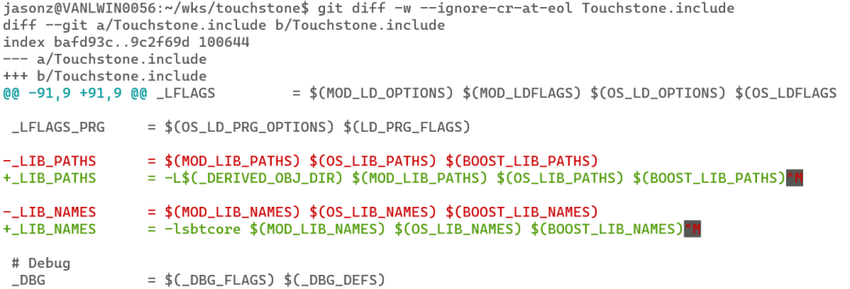
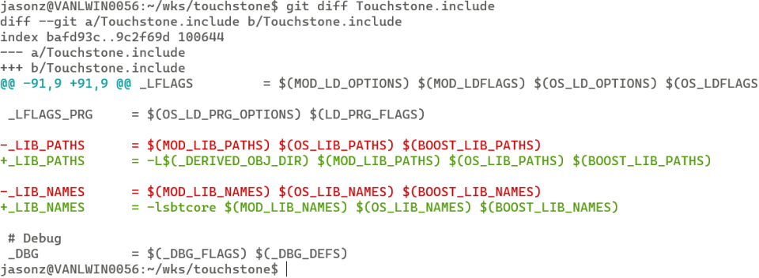

It is nasty to see ^M at end of each line, especially when they are in color.


Here is the solution.
```sh
$ git config --global core.whitespace cr-at-eol
```
* you don't need ``-w`` or ``--ignore-cr-at-eol`` if you just don't want let them visible and don't care the difference.


