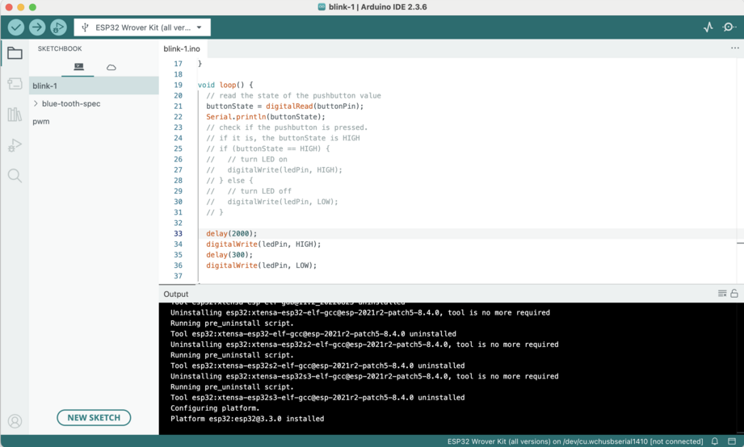
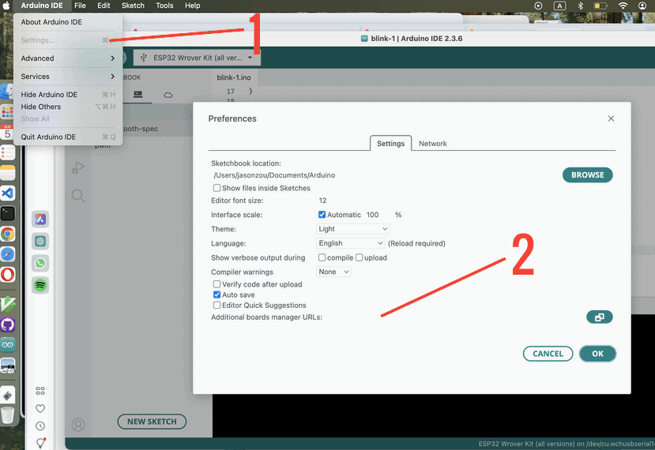

## Update IDE

An old version of Arduino IDE was instlled. Update it to the latest version before the project starts. ESP32 package is updated automatically.

## Add Board Manager

Following Waveshare guide, add board manager.

