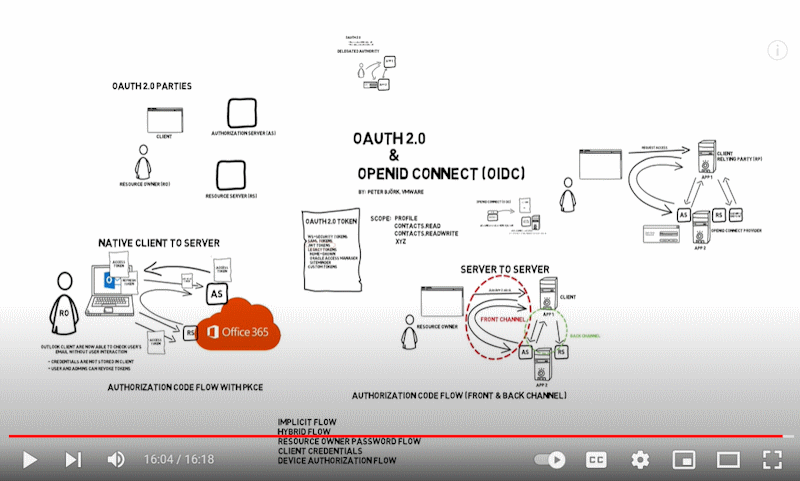
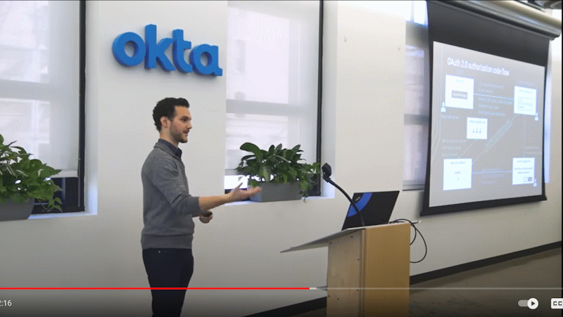
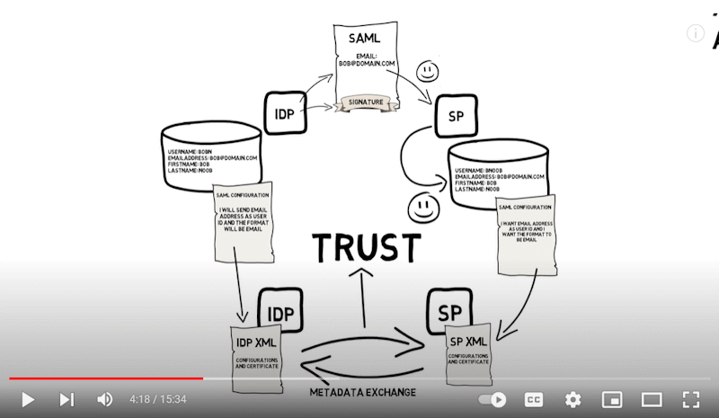
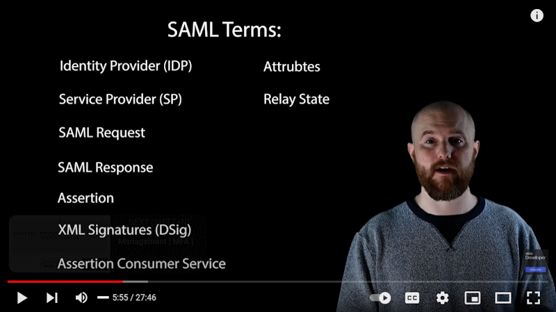

## Single Sign-on

### What is Single Sign-on? How It Works?

4:53

## OAuth

### OAuth 2.0: An Overview

6:33

### OAuth 2.0 & OpenID Connect (OIDC): Technical Overview

by VMware End-User Computing (16:18)

### OAuth 2.0 and OpenID Connect (in plain English)

by OktaDev (1:02:16)

## SAML 2.0

### SAML 2.0: Technical Overview

### A Developer's Guide to SAML

by OktaDev (27:46)

