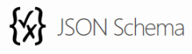
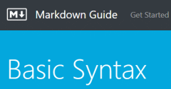

    
    
Free Online XML Validator (Well formed)

    

    

   [Markdown Syntax](https://daringfireball.net/projects/markdown/syntax)

<a href="https://vecta.io/">Powerful, online SVG editor for teams</a>
<a href="https://daringfireball.net/projects/markdown/">Daring Fireball: Markdown</a>
<a href="https://stackedit.io/app#">StackEdit</a>
<a href="https://svg-edit.github.io/svgedit/releases/svg-edit-2.8.1/svg-editor.html">SVG-edit</a>
<a href="https://onpaste.com/">OnPaste - Online Screenshot and Drawing Tool</a>
<a href="https://codesandbox.io/">CodeSandbox: Online Code Editor Tailored for Web Application Development</a>
<a href="https://onlinetexttools.com/">Online Text Tools - Simple, free and easy to use text processing utilities</a>
<a href="https://jbt.github.io/markdown-editor/">Markdown Editor</a>
<a href="http://collabedit.com/">online text editor - collabedit</a>
<a href="https://codebeautify.org/json-tools">Best Online JSON Tools</a>
<a href="https://vectr.com/">Vectr - Free Online Vector Graphics Editor</a>
<a href="https://www.vecteezy.com/">Download Free Vectors, Clip Art Designs, Vector Images &amp; Icons</a>

